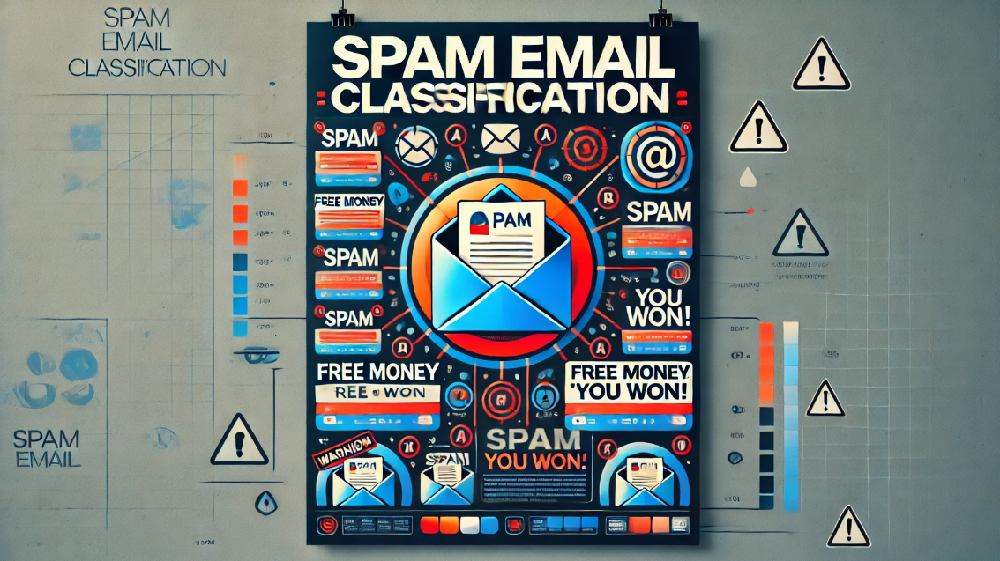

<h1 align="center">📧 SPAM EMAIL DETECTION SYSTEM </h1>

<h2 id="about">📖 About the Project</h2>

Spam emails are a major issue in email communication, clogging inboxes and posing security threats. The Spam Email Classifier project aims to automate the identification of spam emails using the Naive Bayes algorithm and Natural Language Processing (NLP) techniques.
This project processes email content through NLP steps like tokenization, stopword removal, and stemming to extract features. The Naive Bayes classifier then uses these features to predict whether an email is spam or ham (non-spam) based on the likelihood of specific word occurrences.
By leveraging the simplicity and effectiveness of Naive Bayes, this model provides a fast and accurate solution for detecting spam emails, enhancing email management and security.

  

## ✨ Features
- 🚀 **Real-time email classification** with high accuracy.
- 🔍 **NLP-powered text preprocessing** for feature extraction.
- 📊 Supports multiple input formats (`.txt`, `.csv`, `.eml`).
- 🔧 Easily customizable machine learning models.
- 🌟 Interactive and user-friendly interface.

## 🛠️ Technologies Used
- **Programming Language:** Python
- **Libraries:** Scikit-learn, Pandas, NumPy, Matplotlib, NLTK , Seaborn
- **ML Algorithms:** Naive Bayes
- **Deployment:** Streamlit for a lightweight, interactive interface

<h2 id="CLONE"> 🔗 Clone the repository </h2>
git clone https://github.com/amanraj-creator/SPAM-EMAIL-DETECTION-SYSTEM-USING-NLP-AND-MACHINE-LEARNING

## 🤝 Contributing
**We welcome contributions to enhance the Email Spam Detection System! Here's how you can help:**

- **Fork the repository**
- **Create a new branch**
- **Make your changes and commit**
- **Push to your branch**
- **Submit a pull request**

## 📜 License
**This project is licensed under the MIT License**

## 💡 Acknowledgments
- **Inspired by real-world spam detection challenges**
- **Special thanks to the open-source community for libraries and tools**

<h2>🌐 Connect with Me</h2>

  
  
  

 Made with ❤️ by <a href="https://github.com/amanraj-creator">AMAN RAJ</a> 
 
 
